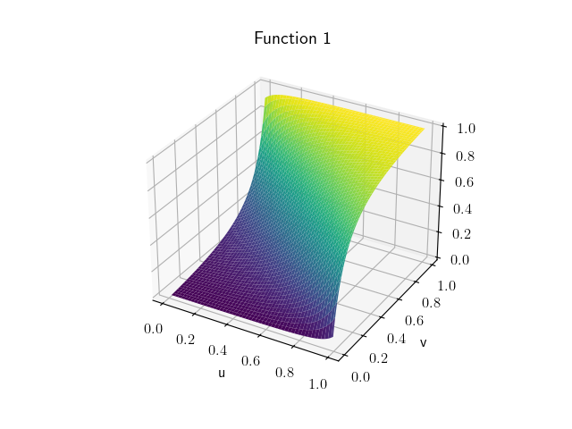
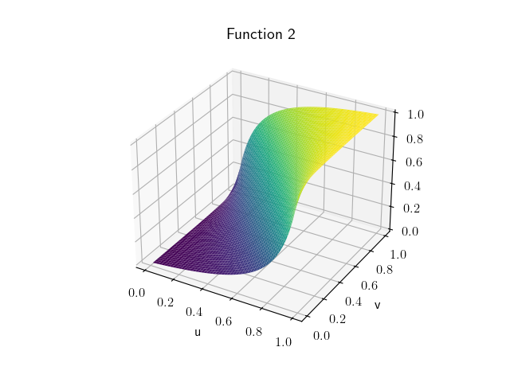
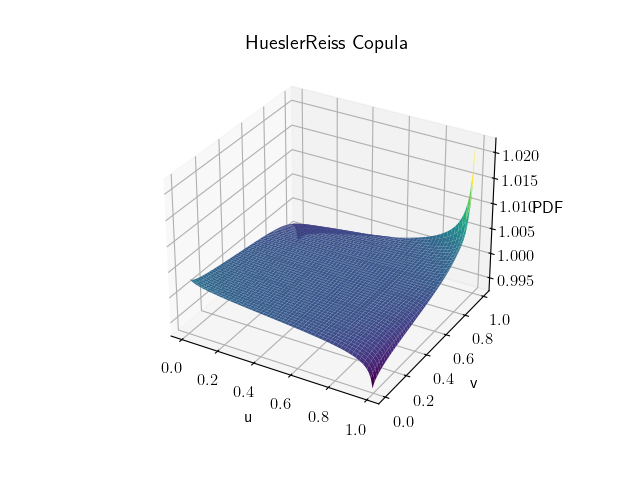
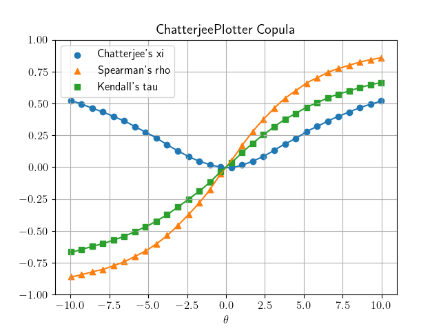

.. copul documentation master file, created by
   sphinx-quickstart on Thu Aug  8 14:14:47 2024.
   You can adapt this file completely to your liking, but it should at least
   contain the root `toctree` directive.

copul documentation
===================

**copul** is a package designed for mathematical computation and visualization of bivariate copula families.
It accompanies the `Dependence properties of bivariate copula families <https://www.degruyter.com/document/doi/10.1515/demo-2024-0002/html>`_ article released in the Dependence Modeling journal and in particular covers implementations of
the following copulas:

- 22 **Archimedean** copula families including Clayton, Gumbel, Frank, Joe, Ali-Mikhail-Haq, and more
- 8 **extreme-value** copulas families including Hüsler-Reiss, Galambos, Marshall-Olkin, etc.
- The **elliptical** copula families Gaussian, Student's t, and Laplace.
- Unclassified copula families like the Farlie-Gumbel-Morgenstern, Plackett or Raftery copula families.
- Independence copula, lower and upper Fréchet bounds
- **Checkerboard** copulas

-------------------

**Perform mathematical computations with copul**

.. highlight:: python
.. code-block:: python

    >>> import copul as cp
    >>> clayton_cdf = cp.Clayton().cdf()
    >>> clayton_cdf
    Max(0, -1 + v**(-theta) + u**(-theta))**(-1/theta)
    >>> clayton_cdf(u=0.5, v=0.5, theta=0.3)
    0.28176656750662277
    >>> cp.AliMikhailHaq(0).pdf()
    1

**Visualize cumulative distribution functions of copulas**

.. highlight:: python
.. code-block:: python

    cp.UpperFrechet().plot_cdf()

.. image:: _static/images/UpperFrechet.png
   :alt: alternate text
   :width: 300px
   :align: center

**Visualize conditional distributions of copulas**::

    plackett = cp.Plackett(0.1)
    plackett.plot(plackett.cond_distr_1, plackett.cond_distr_2)

**Visualize probability density functions of copulas**

.. highlight:: python
.. code-block:: python

    cp.HueslerReiss(0.3).plot_pdf()

**Plot Spearman's rho, Kendall's tau and Chatterjee's xi**

.. highlight:: python
.. code-block:: python

    cp.Frank().plot_chatterjee(100_000, 30)

.. toctree::
   :maxdepth: 2
   :caption: Contents:

   modules

Indices and tables
==================

* :ref:`genindex`
* :ref:`modindex`
* :ref:`search`
