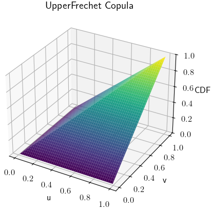
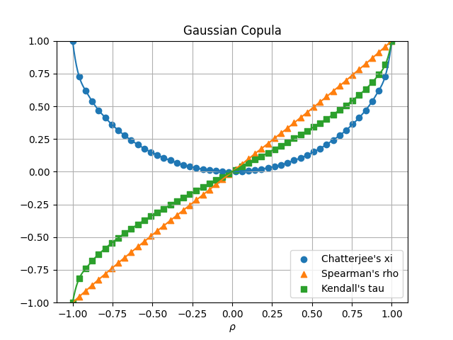

.. copul documentation master file, created by
   sphinx-quickstart on Thu Aug  8 14:14:47 2024.
   You can adapt this file completely to your liking, but it should at least
   contain the root `toctree` directive.

copul documentation
===================

**copul** is a package designed for mathematical computation and visualization of bivariate copula families.
It accompanies the `Dependence properties of bivariate copula families <https://www.degruyter.com/document/doi/10.1515/demo-2024-0002/html>`_ article released in the Dependence Modeling journal and in particular covers implementations of
the following copula families:

- **Archimedean** copula families including Clayton, Gumbel, Frank, Joe, Ali-Mikhail-Haq, and more
- **Extreme-value** copulas families including Hüsler-Reiss, Galambos, Marshall-Olkin, etc.
- **Elliptical** copula families: Gaussian, Student's t, and Laplace.
- Unclassified copula families like the Farlie-Gumbel-Morgenstern, Plackett or Raftery copula families.
- Independence copula, lower and upper Fréchet bounds
- **Checkerboard** copulas

A list of all implemented copulas can be found in :py:mod:`copul.Families`.

-------------------

**Perform mathematical computations with copul**

.. highlight:: python
.. code-block:: python

    >>> import copul as cp
    >>> cp.Clayton().cdf()
    Max(0, -1 + v**(-theta) + u**(-theta))**(-1/theta)
    >>> cp.Clayton().cdf(u=0.5, v=0.5, theta=0.3)
    0.28176656750662277
    >>> cp.AliMikhailHaq(0).pdf()
    1

-------------------

**Generate scatter plots of a copula**

.. highlight:: python
.. code-block:: python

    cp.GenestGhoudi(4).scatter_plot()
    cp.GenestGhoudi(8).scatter_plot()

**Visualize cumulative distribution functions of copulas**

.. highlight:: python
.. code-block:: python

    cp.UpperFrechet().plot_cdf()
    cp.LowerFrechet().plot_cdf()

.. raw:: html

     

**Visualize conditional distributions of copulas**::

    plackett = cp.Plackett(0.1)
    plackett.plot(plackett.cond_distr_1, plackett.cond_distr_2)

.. image:: _static/images/cond_distr_pl_1.png
   :alt: alternate text
   :width: 320px
   :align: left

**Visualize probability density functions of copulas**

.. highlight:: python
.. code-block:: python

    cp.HueslerReiss(0.3).plot_pdf()

.. image:: _static/images/hr_delta0point3_pdf.png
    :alt: alternate text
    :width: 500px
    :align: center

-------------------

**Use matrices for Checkerboard copulas**

Checkerboard copulas are copulas that have probability density functions, which are constant on rectangles and can be represented by matrices.

.. highlight:: python
.. code-block:: python

    >>> import copul as cp
    >>> matr = [[0, 9, 1], [1, 0, 9], [9, 1, 0]]
    >>> ccop = cp.CheckerboardCopula(matr)
    >>> ccop.cdf(0.2, 1)
    0.2
    >>> ccop.pdf(0.2, 1)
    0.03333333333333333
    >>> ccop.scatter_plot()

.. highlight:: python
.. code-block:: python

    >>> ccop.plot_pdf()

-------------------

**Generator and inverse generator functions for Archimedean copulas**

Archimedean copulas are characterized by a generator function, which is available in the package.

.. highlight:: python
.. code-block:: python

    >>> nelsen7 = cp.Nelsen7()
    >>> nelsen7.generator
    -log(t*theta - theta + 1)
    >>> nelsen7.inv_generator
    (theta*exp(y) - exp(y) + 1)*exp(-y)*Heaviside(-y - log(1 - theta))/theta
    >>> cp.Nelsen7(0.5).plot_generator()

**Pickands dependence functions for extreme-value copulas**

Extreme-value copulas are characterized by a pickands dependence function, which is also available in the package.

.. highlight:: python
.. code-block:: python

    >>> galambos = copul.Galambos()
    >>> galambos.pickands
    1 - 1/((1 - t)**(-delta) + t**(-delta))**(1/delta)
    >>> galambos.plot_pickands(delta=[0.5, 1, 2])

-------------------

**Spearman's rho, Kendall's tau and Chatterjee's xi**

.. highlight:: python
.. code-block:: python

    >>> cp.CuadrasAuge().rho()
    -3*delta/(delta - 4)
    >>> cp.CuadrasAuge(0.5).rho()
    0.428571428571427
    >>> cp.FarlieGumbelMorgenstern().tau()
    2*theta/9
    >>> cp.AliMikhailHaq().xi()
    -theta/6 - 0.666666666666667 + 3/theta - 2/theta**2 - 2*(1 - theta)**2*log(1 - theta)/theta**3
    >>> cp.Frank().plot_rank_correlations(1_000_000, 50)

.. toctree::
   :maxdepth: 2
   :caption: Contents:

   modules

Indices and tables
==================

* :ref:`genindex`
* :ref:`modindex`
* :ref:`search`
